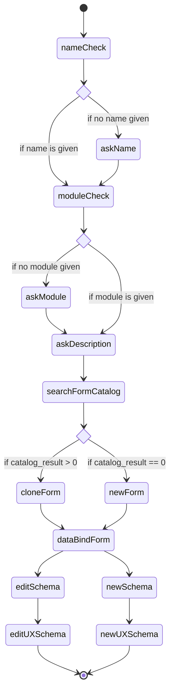

# Form Macro
This macro will create a new Reactory Form component. See the mermaid diagram for context.

```mermaid
%% diagram describes the flow of code when 
stateDiagram-v2
    state if_name <<choice>>
    state if_module <<choice>>
    state catalog_result <<choice>>
    [*] --> nameCheck
    nameCheck --> if_name
    if_name --> askName: if no name given
    if_name --> moduleCheck: if name is given
    askName --> moduleCheck
    moduleCheck --> if_module
    if_module --> askModule: if no module given 
    askModule --> askDescription
    if_module --> askDescription: if module is given
    askDescription --> searchFormCatalog
    searchFormCatalog --> catalog_result
    catalog_result --> cloneForm: if catalog_result > 0
    cloneForm --> dataBindForm
    catalog_result --> newForm: if catalog_result == 0
    newForm --> dataBindForm
    dataBindForm --> editSchema        
    editSchema --> editUXSchema
    dataBindForm --> newSchema
    newSchema --> newUXSchema
    editUXSchema --> [*]
    newUXSchema --> [*]
```