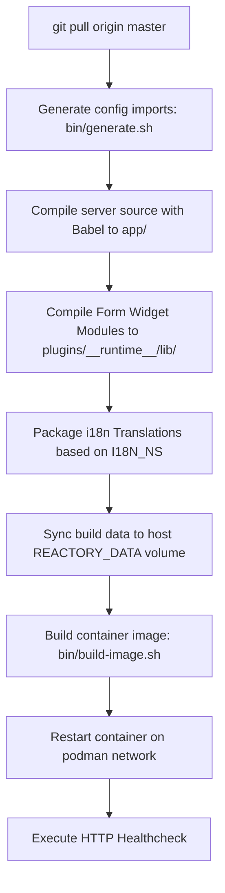

# Remote Host Deployment & Container Debugging

This skill provides step-by-step instructions, operational patterns, and troubleshooting procedures for deploying and debugging Reactory applications across remote target hosts via SSH and rootless Podman.

---

## 1. Remote Host SSH Setup & Key Configuration

To enable automated single-command deployments without manual password prompts, configure Ed25519 or RSA SSH keys.

### 1.1 Generating Keypair (Local Host)
```bash
# Generate high-security Ed25519 keypair if not already present
ssh-keygen -t ed25519 -C "reactor-deploy@reactory.net" -f ~/.ssh/id_ed25519 -N ""
```

### 1.2 Copying Public Key to Remote Host
```bash
# Push public key to target host (e.g. 192.168.0.17 user 'reactor')
ssh-copy-id -i ~/.ssh/id_ed25519.pub reactor@192.168.0.17
```

### 1.3 Configuring SSH Client Config (`~/.ssh/config`)
Add a persistent host alias for fast access and connection multiplexing:
```ssh-config
Host reactory-node-1
  HostName 192.168.0.17
  User reactor
  IdentityFile ~/.ssh/id_ed25519
  ServerAliveInterval 60
  ServerAliveCountMax 3
  ControlMaster auto
  ControlPath ~/.ssh/sockets/%r@%h:%p
  ControlPersist 10m
```

### 1.4 Verifying Passwordless Access
```bash
ssh reactor@192.168.0.17 "echo 'SSH authentication successful: '\$(hostname) && podman --version"
```

---

## 2. Directory Layout & Environment Variables

All Reactory nodes adhere to the standard directory layout under the user home folder (`/home/reactor/reactory`):

```text
/home/reactor/reactory/
├── reactory-core/               # Shared TypeScript core models/interfaces
├── reactory-data/               # Persistent data, forms, i18n, plugins runtime, profiles
│   ├── forms/                   # Form YAML schemas
│   ├── i18n/                    # Localized translation JSON bundles (en-US, af, etc.)
│   └── plugins/__runtime__/lib/ # Pre-compiled widget JS and source maps
├── reactory-express-server/     # Express API & GraphQL backend
└── reactory-pwa-client/         # React PWA frontend
```

### 2.1 Essential Environment Variables (`~/.bashrc` on Remote Host)
```bash
export REACTORY_HOME=/home/reactor/reactory
export REACTORY_DATA=/home/reactor/reactory/reactory-data
export REACTORY_SERVER=/home/reactor/reactory/reactory-express-server
export REACTORY_CLIENT=/home/reactor/reactory/reactory-pwa-client
export REACTORY_PLUGINS=/home/reactor/reactory/reactory-data/plugins
```

---

## 3. Deployment Workflow & Build Pipeline

The server deployment pipeline is automated via `bin/deploy-podman.sh [config-id] [env-id]`.



### 3.1 Server Deployment Command
```bash
ssh reactor@192.168.0.17 "cd ~/reactory/reactory-express-server && bin/deploy-podman.sh reactory podman"
```

### 3.2 Client Deployment Command
```bash
ssh reactor@192.168.0.17 "cd ~/reactory/reactory-pwa-client && bin/deploy-podman.sh reactory podman 9000"
```

---

## 4. Translation Packaging (`I18N_NS`)

The build pipeline parses `I18N_NS` from the configuration environment file (`config/<config-id>/.env.<env-id>`).

- **Namespaces Packaged**:
  - Core defaults: `common`, `forms`, `models`, `services`, `workflow`, `schemas`, `cli`.
  - Configured namespaces: e.g. `reactory,reactor,booktutor,zepz-engineer`.
  - Fallback: If `I18N_NS` is missing or empty, `reactory` is always packaged.
- **Locales Processed**: Scans all subfolders in `$REACTORY_DATA/i18n` (`en-US`, `en`, `af`).
- **Output Destination**: `$BUILD_PATH/data/i18n/<locale>/<ns>.json`, synchronized automatically to `${REACTORY_DATA}/i18n/`.

---

## 5. Form Widget Pre-compilation (`plugins/__runtime__`)

Dynamic form widgets are compiled into standalone UMD bundles via Rollup using `bin/utils/build/compile-form-modules.ts`.

- Evaluates code-defined and YAML forms.
- Compiles TSX widgets with external React/ReactDOM bindings.
- Generates `bin/build.runtime-plugins.rsync` filter.
- Outputs bundles to `$BUILD_PATH/data/plugins/__runtime__/lib/` and synchronizes to `${REACTORY_DATA}/plugins/__runtime__/lib/`.
- Served via Express CDN endpoint `/cdn/plugins/__runtime__/lib/<module-id>.min.js`.

---

## 6. Remote Container Debugging & Diagnostics

When debugging container startup or runtime issues on the remote node:

### 6.1 Inspect Running Containers & Status
```bash
ssh reactor@192.168.0.17 "podman ps -a"
```

### 6.2 Tail Real-time Logs
```bash
# Server backend logs
ssh reactor@192.168.0.17 "podman logs -f --tail 50 reactory-express-server"

# Client Nginx logs
ssh reactor@192.168.0.17 "podman logs -f --tail 50 reactory-pwa-client"
```

### 6.3 Execute Commands Inside Running Pods
```bash
# Check environment inside container
ssh reactor@192.168.0.17 "podman exec reactory-express-server env"

# Verify volume mount accessibility
ssh reactor@192.168.0.17 "podman exec reactory-express-server ls -la /reactory/reactory-data/plugins/__runtime__/lib"
```

### 6.4 Common Issues & Resolutions

| Issue | Cause | Fix |
| :--- | :--- | :--- |
| **SELinux Permission Denied (`EACCES`)** | Container volume mount missing label flag | Ensure `-v "${REACTORY_DATA}":/reactory/reactory-data:z` includes `:z` or `:Z`. |
| **401 Unauthorized on CDN Assets** | CDN path not in `bypassUri` whitelist | Verify `ReactoryClient.ts` includes `/cdn/plugins/`, `/cdn/content/`, etc. |
| **Module Not Found during Build** | `APPLICATION_ROOT=app` set before build output is present | Use `getDataRoot()` helper and check `src/modules/__index.ts` fallbacks. |
| **Yarn Native Build Failure (sharp, canvas)** | Missing C++ / system dev packages in Dockerfile | Add `libvips-dev`, `pkg-config`, `python3`, `build-essential` to container Dockerfile. |
