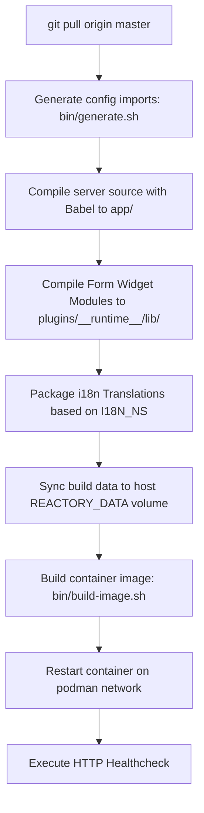

# Remote Host Deployment & Container Debugging

This skill provides step-by-step instructions, operational patterns, and troubleshooting procedures for deploying and debugging Reactory applications across remote target hosts via SSH, rootless Podman, and Nginx reverse proxy gateways.

---

## 1. Remote Host SSH Setup & Key Configuration

To enable automated single-command deployments without manual password prompts, configure Ed25519 or RSA SSH keys.

### 1.1 Generating Keypair (Local Host)
```bash
# Generate high-security Ed25519 keypair if not already present
ssh-keygen -t ed25519 -C "reactor-deploy@reactory.net" -f ~/.ssh/id_ed25519 -N ""
```

### 1.2 Copying Public Key to Remote Host
```bash
# Push public key to target host (e.g. 192.168.0.17 user 'reactor')
ssh-copy-id -i ~/.ssh/id_ed25519.pub reactor@192.168.0.17
```

### 1.3 Configuring SSH Client Config (`~/.ssh/config`)
Add a persistent host alias for fast access and connection multiplexing:
```ssh-config
Host reactory-node-1
  HostName 192.168.0.17
  User reactor
  IdentityFile ~/.ssh/id_ed25519
  ServerAliveInterval 60
  ServerAliveCountMax 3
  ControlMaster auto
  ControlPath ~/.ssh/sockets/%r@%h:%p
  ControlPersist 10m
```

### 1.4 Verifying Passwordless Access
```bash
ssh reactor@192.168.0.17 "echo 'SSH authentication successful: '\$(hostname) && podman --version"
```

---

## 2. Directory Layout & Environment Variables

All Reactory nodes adhere to the standard directory layout under the user home folder (`/home/reactor/reactory`):

```text
/home/reactor/reactory/
├── reactory-core/               # Shared TypeScript core models/interfaces
├── reactory-data/               # Persistent data, forms, i18n, plugins runtime, profiles
│   ├── forms/                   # Form YAML schemas
│   ├── i18n/                    # Localized translation JSON bundles (en-US, af, etc.)
│   └── plugins/__runtime__/lib/ # Pre-compiled widget JS and source maps
├── reactory-express-server/     # Express API & GraphQL backend
└── reactory-pwa-client/         # React PWA frontend
```

### 2.1 Essential Environment Variables (`~/.bashrc` on Remote Host)
```bash
export REACTORY_HOME=/home/reactor/reactory
export REACTORY_DATA=/home/reactor/reactory/reactory-data
export REACTORY_SERVER=/home/reactor/reactory/reactory-express-server
export REACTORY_CLIENT=/home/reactor/reactory/reactory-pwa-client
export REACTORY_PLUGINS=/home/reactor/reactory/reactory-data/plugins
```

---

## 3. Deployment Workflow & Build Pipeline

The server deployment pipeline is automated via `bin/deploy-podman.sh [config-id] [env-id]`.



### 3.1 Server Deployment Command
```bash
ssh reactor@192.168.0.17 "cd ~/reactory/reactory-express-server && bin/deploy-podman.sh reactory podman"
```

### 3.2 Client Deployment Command (Multi-Client)
```bash
# Deploy Reactory Management Client
ssh reactor@192.168.0.17 "cd ~/reactory/reactory-pwa-client && bin/deploy-podman.sh reactory podman 9000"

# Deploy BookTutor Client
ssh reactor@192.168.0.17 "cd ~/reactory/reactory-pwa-client && bin/deploy-podman.sh booktutor podman 9001"
```

---

## 4. Multi-Client Reverse Proxy Gateway & Dynamic DNS Resolution

In multi-client environments, an Nginx Gateway container serves as the ingress point dispatching by `Host` header.

### 4.1 Resolving Stale Upstream IPs (502 Bad Gateway Fix)
In Docker/Podman container networks, restarting containers dynamically reallocates bridge IPs. Standard Nginx `upstream { server ...; }` blocks resolve DNS only once at startup and cache the IP permanently, causing `502 Bad Gateway (113: Host is unreachable)` upon container restarts.

**Fix**: Set a dynamic `resolver` with short TTL and use variable-backed `proxy_pass`:
```nginx
events {
    worker_connections 1024;
}

http {
    include       /etc/nginx/mime.types;
    default_type  application/octet-stream;
    sendfile        on;
    keepalive_timeout  65;
    client_max_body_size 100M;
    
    # Internal Podman DNS resolver
    resolver 10.89.0.1 valid=5s ipv6=off;

    # 1. API Server (api.reactory.local)
    server {
        listen 80;
        server_name api.reactory.local;

        location / {
            set $backend "http://reactory-express-server:4000";
            proxy_pass $backend;
            proxy_http_version 1.1;
            proxy_set_header Upgrade $http_upgrade;
            proxy_set_header Connection "upgrade";
            proxy_set_header Host $host;
            proxy_set_header X-Real-IP $remote_addr;
            proxy_set_header X-Forwarded-For $proxy_add_x_forwarded_for;
            proxy_set_header X-Forwarded-Proto $scheme;
            proxy_read_timeout 300s;
            proxy_send_timeout 300s;
        }
    }

    # 2. BookTutor Client (booktutor.reactory.local)
    server {
        listen 80;
        server_name booktutor.reactory.local;

        location / {
            set $booktutor_client "http://booktutor-pwa-client:80";
            proxy_pass $booktutor_client;
            proxy_http_version 1.1;
            proxy_set_header Upgrade $http_upgrade;
            proxy_set_header Connection "upgrade";
            proxy_set_header Host $host;
            proxy_set_header X-Real-IP $remote_addr;
            proxy_set_header X-Forwarded-For $proxy_add_x_forwarded_for;
            proxy_set_header X-Forwarded-Proto $scheme;
        }
    }

    # 3. Reactory Management Client (reactory.local, default)
    server {
        listen 80 default_server;
        server_name reactory.local www.reactory.local app.reactory.local _;

        location / {
            set $reactory_client "http://reactory-pwa-client:80";
            proxy_pass $reactory_client;
            proxy_http_version 1.1;
            proxy_set_header Upgrade $http_upgrade;
            proxy_set_header Connection "upgrade";
            proxy_set_header Host $host;
            proxy_set_header X-Real-IP $remote_addr;
            proxy_set_header X-Forwarded-For $proxy_add_x_forwarded_for;
            proxy_set_header X-Forwarded-Proto $scheme;
        }
    }
}
```

---

## 5. Domain Conventions & HSTS Considerations

- **`.dev` TLD HSTS Restriction**: `.dev` is hardcoded in the Chromium/Firefox global HSTS Preload list. Browsers strictly require HTTPS and reject plain HTTP, resulting in `ERR_SSL_PROTOCOL_ERROR`.
- **Local Development TLDs**: Use `.local`, `.test`, or `.lan` (e.g. `reactory.local`, `booktutor.reactory.local`, `api.reactory.local`) for HTTP development and test nodes without SSL certificate requirements.
- **Local Hosts Entry**:
  ```text
  192.168.0.17  reactory.local www.reactory.local app.reactory.local api.reactory.local booktutor.reactory.local
  ```

---

## 6. Client Password & Authentication Verification

- **`x-client-pwd` Header Validation**: `ReactoryClientAuthenticationMiddleware` hashes `x-client-pwd` with the client's salt in MongoDB. The client's compile-time `REACT_APP_CLIENT_PASSWORD` must strictly match the server secret (`REACTORY_APPLICATION_PASSWORD` / client configuration password), otherwise all GraphQL and API calls will fail with `401 Credentials Invalid`.
- **Mongoose Themes Schema**: In `ReactoryClientMongooseSchema`, `themes` must be defined as `[mongoose.Schema.Types.Mixed]` rather than empty subdocument schemas `[{ _id: false }]` to avoid property stripping on startup upsert.

---

## 7. Remote Container Debugging & Diagnostics

When debugging container startup or runtime issues on the remote node:

### 7.1 Inspect Running Containers & Status
```bash
ssh reactor@192.168.0.17 "podman ps -a"
```

### 7.2 Tail Real-time Logs
```bash
# Server backend logs
ssh reactor@192.168.0.17 "podman logs -f --tail 50 reactory-express-server"

# Client Nginx logs
ssh reactor@192.168.0.17 "podman logs -f --tail 50 reactory-pwa-client"

# Gateway logs
ssh reactor@192.168.0.17 "podman logs -f --tail 50 reactory-gateway"
```

### 7.3 Common Issues & Resolutions

| Issue | Cause | Fix |
| :--- | :--- | :--- |
| **502 Bad Gateway (Nginx)** | Stale upstream container IP cached by Nginx | Add `resolver 10.89.0.1 valid=5s;` and use `set $upstream ...; proxy_pass $upstream;`. |
| **ERR_SSL_PROTOCOL_ERROR** | `.dev` domain accessed over HTTP (HSTS Preload) | Switch to `.local` domain suffix (e.g. `reactory.local`). |
| **401 Credentials Invalid on /graphql** | `REACT_APP_CLIENT_PASSWORD` mismatch | Synchronize `REACT_APP_CLIENT_PASSWORD` with MongoDB password hash. |
| **SELinux Permission Denied (`EACCES`)** | Container volume mount missing label flag | Ensure `-v "${REACTORY_DATA}":/reactory/reactory-data:z` includes `:z` or `:Z`. |
| **401 Unauthorized on CDN Assets** | CDN path not in `bypassUri` whitelist | Verify `ReactoryClient.ts` includes `/cdn/plugins/`, `/cdn/content/`, etc. |
| **Themes Stripped to `[{}]`** | Empty subdocument schema in Mongoose | Define `themes: [Mixed]` in `ReactoryClient/schema.ts`. |
