# AI Memory Systems and Adaptive Learning Research

## Overview

This document explores advanced concepts in AI automation, focusing on memory management, learning systems, and adaptive behaviors. The goal is to understand how to build AI agents that can maintain long-term relationships with users through persistent memory and continuous learning.

## Table of Contents

1. [Memory Systems in AI](#memory-systems-in-ai)
2. [Graph Databases for AI Memory](#graph-databases-for-ai-memory)
3. [Short-term vs Long-term Memory](#short-term-vs-long-term-memory)
4. [Adaptive Learning Systems](#adaptive-learning-systems)
5. [Implementation Strategies](#implementation-strategies)
6. [Architecture Patterns](#architecture-patterns)
7. [Technologies and Tools](#technologies-and-tools)
8. [Use Cases and Applications](#use-cases-and-applications)

## Memory Systems in AI

### Traditional Context Management vs Memory Systems

Traditional LLM interactions are stateless, relying on context windows that have inherent limitations:
- **Token limits** restrict conversation length
- **No persistence** between sessions
- **Context degradation** as conversations grow
- **No learning** from past interactions

Advanced memory systems address these limitations by providing:
- **Persistent storage** of interactions and learned patterns
- **Hierarchical memory** structures (working, short-term, long-term)
- **Selective retrieval** of relevant past information
- **Continuous learning** and adaptation

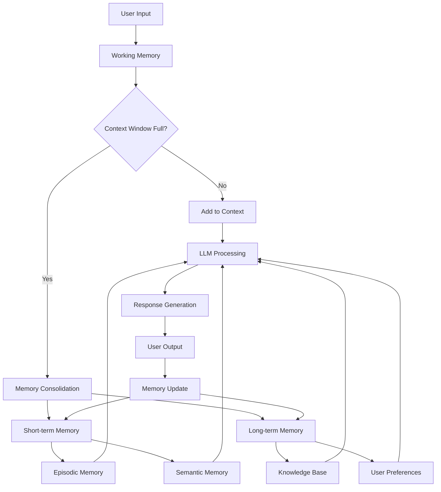

### Memory Types and Functions

#### 1. Working Memory
- **Function**: Immediate processing of current conversation
- **Characteristics**: Limited capacity, high accessibility
- **Implementation**: Current context window, active variables
- **Duration**: Current session only

#### 2. Short-term Memory (Episodic)
- **Function**: Recent interactions and conversation context
- **Characteristics**: Temporary storage, contextually relevant
- **Implementation**: Recent conversation history, session state
- **Duration**: Hours to days

#### 3. Long-term Memory (Semantic)
- **Function**: Persistent knowledge about user, domain, and relationships
- **Characteristics**: Permanent storage, organized knowledge
- **Implementation**: Knowledge graphs, vector databases, structured data
- **Duration**: Indefinite, with periodic consolidation

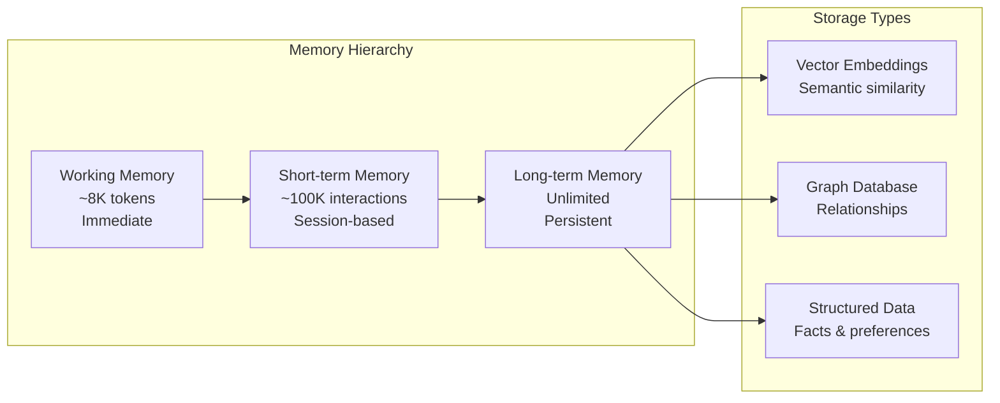

## Graph Databases for AI Memory

### Why Graph Databases?

Graph databases excel at representing and querying complex relationships, making them ideal for AI memory systems:

1. **Relationship-centric**: Natural modeling of user interactions, preferences, and knowledge
2. **Flexible schema**: Easy to evolve as understanding of user grows
3. **Fast traversals**: Efficient retrieval of connected information
4. **Pattern matching**: Discover implicit relationships and behaviors
5. **Temporal modeling**: Track how relationships and preferences change over time

### Graph Database Options

#### Neo4j
- **Strengths**: Mature ecosystem, Cypher query language, ACID compliance
- **Use case**: Complex relationship queries, pattern detection
- **Integration**: Direct REST API, driver libraries

#### Amazon Neptune
- **Strengths**: Managed service, supports both property graphs and RDF
- **Use case**: Cloud-native applications, high availability
- **Integration**: AWS ecosystem, Gremlin/SPARQL support

#### ArangoDB
- **Strengths**: Multi-model (document, key-value, graph)
- **Use case**: Hybrid data requirements
- **Integration**: AQL query language, REST API

#### DGraph
- **Strengths**: Distributed, GraphQL native
- **Use case**: High-performance, scalable applications
- **Integration**: GraphQL interface, Go-native

### Graph Schema Design for AI Memory

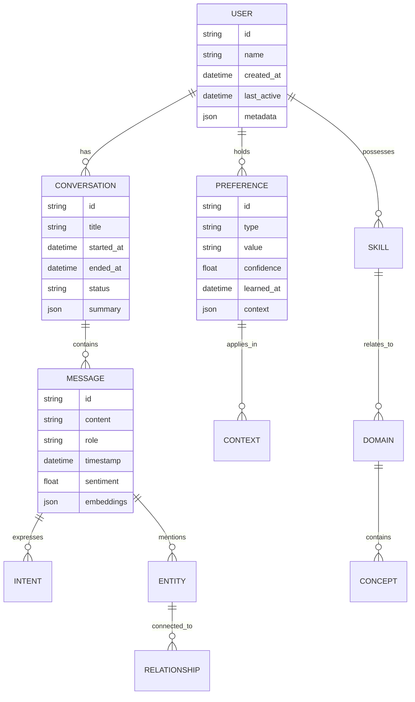

### Advanced Graph Patterns

#### Temporal Relationships
Track how user preferences and behaviors evolve over time:

```cypher
// Find preference changes over time
MATCH (u:User)-[r:HAS_PREFERENCE]->(p:Preference)
WHERE r.timestamp > date('2024-01-01')
RETURN p.type, p.value, r.timestamp, r.confidence
ORDER BY r.timestamp DESC
```

#### Semantic Clustering
Group related concepts and entities:

```cypher
// Find semantically related topics user is interested in
MATCH (u:User)-[:DISCUSSED]->(t1:Topic)
MATCH (t1)-[:SIMILAR_TO*1..3]-(t2:Topic)
RETURN t2.name, count(*) as frequency
ORDER BY frequency DESC
LIMIT 10
```

#### Influence Networks
Model how different factors influence user decisions:

```cypher
// Discover influence patterns
MATCH (u:User)-[:INFLUENCED_BY]->(f:Factor)
MATCH (f)-[:LEADS_TO]->(d:Decision)
RETURN f.type, d.outcome, count(*) as occurrences
```

## Short-term vs Long-term Memory

### Memory Consolidation Process

The process of moving information from short-term to long-term memory involves:

1. **Relevance Assessment**: Determine importance and frequency of information
2. **Pattern Recognition**: Identify recurring themes and relationships
3. **Abstraction**: Extract generalizable insights from specific interactions
4. **Integration**: Merge new information with existing knowledge
5. **Optimization**: Compress and organize for efficient retrieval

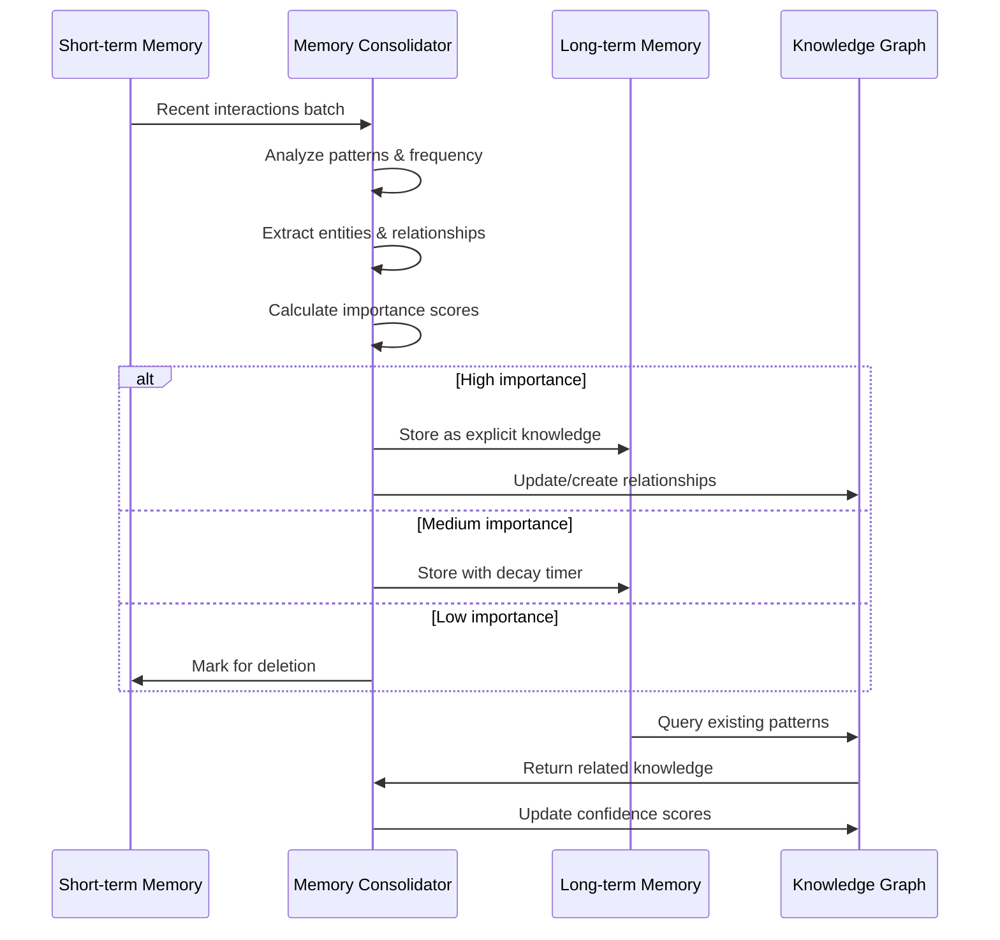

### Forgetting Mechanisms

Intelligent forgetting is crucial for memory systems:

#### 1. Decay-based Forgetting
- Information naturally loses importance over time
- Exponential decay functions based on access frequency
- Prevents memory pollution with irrelevant data

#### 2. Interference-based Forgetting
- Newer information supersedes older, conflicting data
- Maintains consistency in user preferences
- Handles changing user behaviors

#### 3. Capacity-based Forgetting
- Remove least important information when storage limits reached
- Preserve high-value, frequently accessed knowledge
- Optimize for query performance

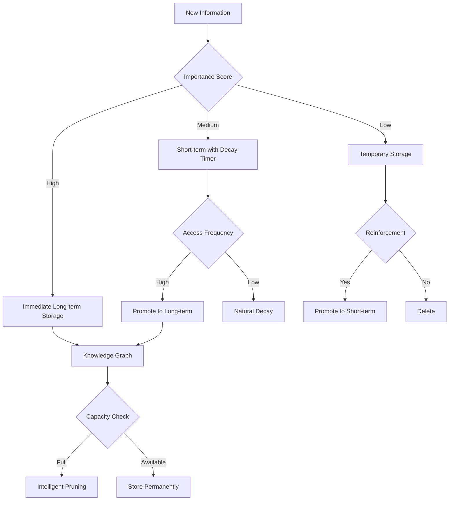

## Adaptive Learning Systems

### Learning Mechanisms

#### 1. Reinforcement Learning from Human Feedback (RLHF)
- **Process**: Collect user feedback on AI responses
- **Adaptation**: Adjust response generation based on preferences
- **Implementation**: Reward/penalty systems, preference modeling
- **Benefits**: Personalized interactions, improved satisfaction

#### 2. Meta-Learning (Learning to Learn)
- **Process**: Learn patterns in how user learns and adapts
- **Adaptation**: Adjust teaching/explanation strategies
- **Implementation**: Few-shot learning, transfer learning
- **Benefits**: Faster adaptation to new domains, efficient knowledge transfer

#### 3. Continual Learning
- **Process**: Continuously update knowledge without forgetting
- **Adaptation**: Incremental learning from each interaction
- **Implementation**: Elastic weight consolidation, experience replay
- **Benefits**: No catastrophic forgetting, always up-to-date

### Adaptation Strategies

#### User Modeling
Build comprehensive models of user characteristics:

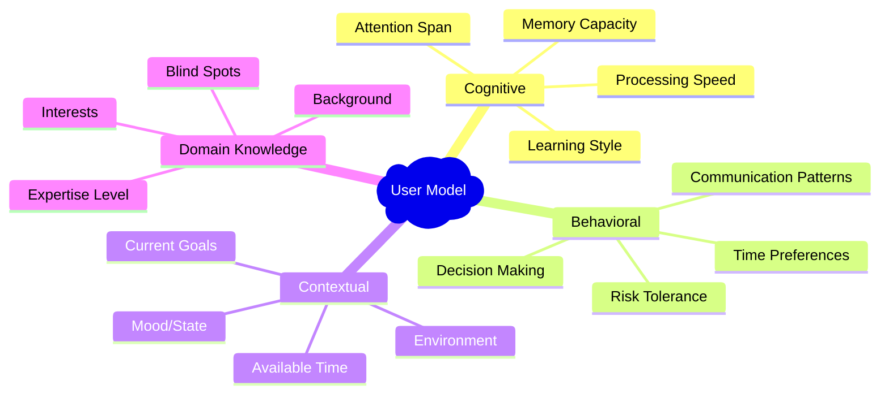

#### Dynamic Personalization

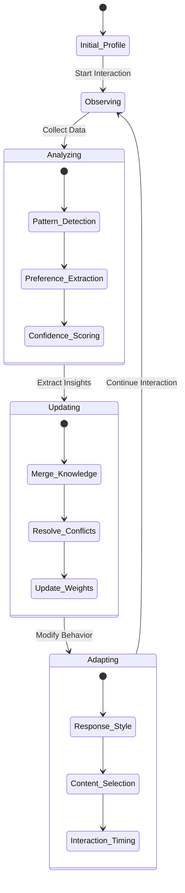

### Learning Feedback Loops

#### Explicit Feedback
- Direct user ratings and corrections
- Preference declarations
- Goal adjustments
- Feature requests

#### Implicit Feedback
- Interaction patterns (clicks, time spent, scrolling)
- Question types and frequency
- Task completion rates
- Return behavior

#### Environmental Feedback
- Context changes (time, location, device)
- External data sources
- System performance metrics
- Usage analytics

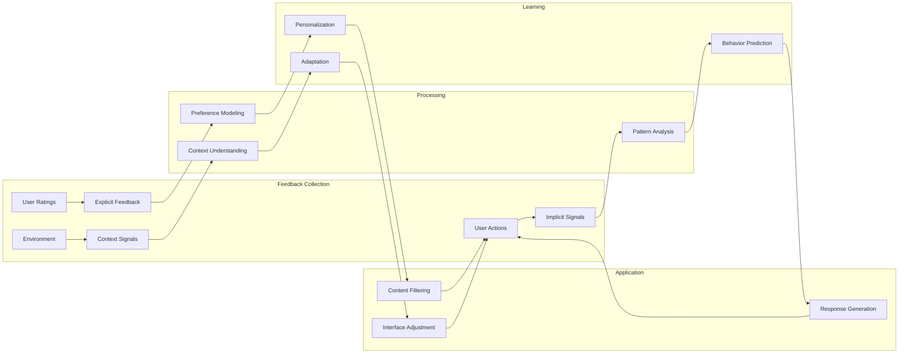

## Implementation Strategies

### Architecture Patterns

#### 1. Layered Memory Architecture

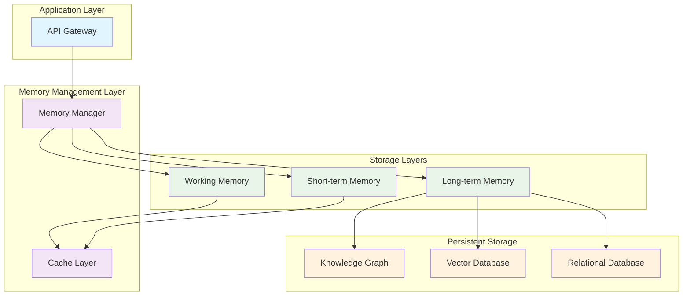

#### 2. Event-Driven Memory Updates

```typescript
interface MemoryEvent {
  type: 'interaction' | 'preference' | 'knowledge' | 'context';
  data: any;
  timestamp: Date;
  importance: number;
  userId: string;
}

class MemoryEventProcessor {
  async processEvent(event: MemoryEvent): Promise<void> {
    // Route to appropriate handler
    switch (event.type) {
      case 'interaction':
        await this.updateInteractionHistory(event);
        break;
      case 'preference':
        await this.updateUserPreferences(event);
        break;
      case 'knowledge':
        await this.updateKnowledgeGraph(event);
        break;
      case 'context':
        await this.updateContextualMemory(event);
        break;
    }
    
    // Trigger consolidation if needed
    if (this.shouldConsolidate()) {
      await this.triggerMemoryConsolidation(event.userId);
    }
  }
}
```

#### 3. Retrieval-Augmented Memory

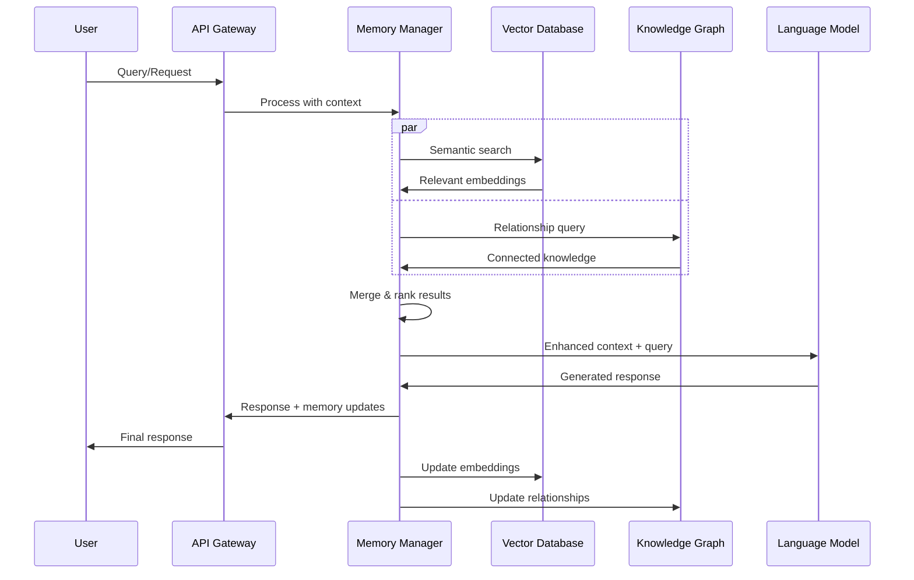

### Technology Stack Recommendations

#### Core Components

1. **Memory Management**: Redis + PostgreSQL + Neo4j
2. **Vector Search**: Pinecone, Weaviate, or Qdrant
3. **Graph Database**: Neo4j or Amazon Neptune
4. **Message Queue**: Apache Kafka or RabbitMQ
5. **Caching**: Redis with clustering
6. **Monitoring**: Prometheus + Grafana

#### Integration Patterns

```typescript
class AIMemorySystem {
  constructor(
    private vectorDB: VectorDatabase,
    private graphDB: GraphDatabase,
    private cache: CacheManager,
    private eventBus: EventBus
  ) {}
  
  async query(userId: string, query: string): Promise<MemoryContext> {
    // Multi-source memory retrieval
    const [vectorResults, graphResults, recentContext] = await Promise.all([
      this.vectorDB.semanticSearch(query, { userId, limit: 10 }),
      this.graphDB.findRelatedKnowledge(userId, query),
      this.cache.getRecentContext(userId)
    ]);
    
    // Intelligent merge and ranking
    return this.mergeAndRank(vectorResults, graphResults, recentContext);
  }
  
  async learn(userId: string, interaction: Interaction): Promise<void> {
    // Extract learning signals
    const signals = await this.extractLearningSignals(interaction);
    
    // Update memory systems
    await Promise.all([
      this.updateVectorMemory(userId, signals),
      this.updateGraphMemory(userId, signals),
      this.updateCache(userId, interaction)
    ]);
    
    // Publish learning event
    this.eventBus.publish('memory.updated', { userId, signals });
  }
}
```

## Technologies and Tools

### Memory Storage Technologies

#### Vector Databases
- **Pinecone**: Managed, high-performance vector search
- **Weaviate**: Open-source with GraphQL interface
- **Qdrant**: Rust-based, high-performance
- **Chroma**: Simple, local development-friendly
- **Milvus**: Large-scale vector similarity search

#### Graph Databases
- **Neo4j**: Industry standard, Cypher query language
- **Amazon Neptune**: Managed AWS service
- **ArangoDB**: Multi-model database
- **DGraph**: Distributed, GraphQL native
- **TigerGraph**: High-performance analytics

#### Traditional Databases with Extensions
- **PostgreSQL + pgvector**: SQL with vector support
- **MongoDB**: Document store with vector search
- **Elasticsearch**: Full-text search with dense vectors

### AI/ML Frameworks

#### Memory-Augmented Models
- **MemGPT**: Operating system for LLMs with memory
- **LangChain**: Framework for memory-aware applications
- **AutoGen**: Multi-agent systems with persistent memory
- **CrewAI**: Collaborative AI agents with shared memory

#### Learning Frameworks
- **Ray**: Distributed reinforcement learning
- **Weights & Biases**: Experiment tracking and model management
- **MLflow**: Machine learning lifecycle management
- **Kubeflow**: ML workflows on Kubernetes

### Development Tools

#### Observability
```yaml
# Prometheus metrics for memory systems
memory_operations_total:
  type: counter
  labels: [operation, user_id, memory_type]

memory_retrieval_duration_seconds:
  type: histogram
  labels: [query_type, user_id]

memory_size_bytes:
  type: gauge
  labels: [user_id, memory_type]

learning_accuracy_score:
  type: gauge
  labels: [user_id, domain]
```

#### Testing Strategies
```typescript
describe('Memory System', () => {
  test('should consolidate short-term to long-term memory', async () => {
    // Setup: Add interactions to short-term memory
    const interactions = generateTestInteractions(100);
    await memorySystem.addToShortTerm(userId, interactions);
    
    // Execute: Trigger consolidation
    await memorySystem.consolidateMemory(userId);
    
    // Verify: Check long-term memory contents
    const longTermMemory = await memorySystem.getLongTermMemory(userId);
    expect(longTermMemory).toContainImportantPatterns();
  });
  
  test('should adapt responses based on user preferences', async () => {
    // Setup: Establish user preference
    await memorySystem.learnPreference(userId, 'communication_style', 'concise');
    
    // Execute: Generate response
    const response = await aiAgent.generateResponse(userId, 'explain quantum computing');
    
    // Verify: Response matches preferred style
    expect(response).toBeConciseStyle();
  });
});
```

## Use Cases and Applications

### Personal AI Assistants

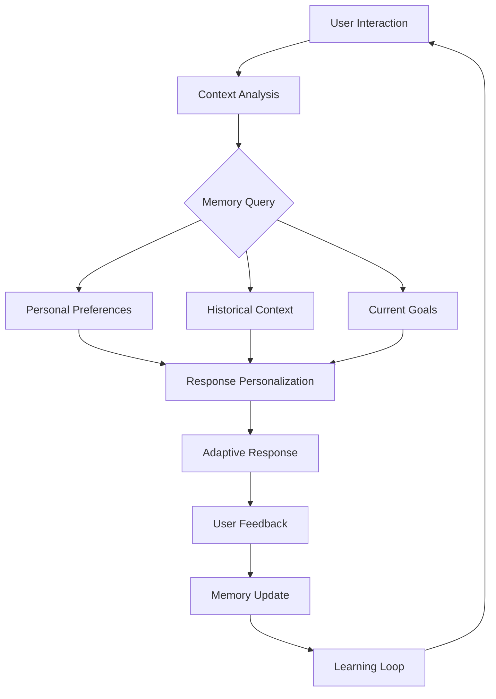

### Educational AI Tutors

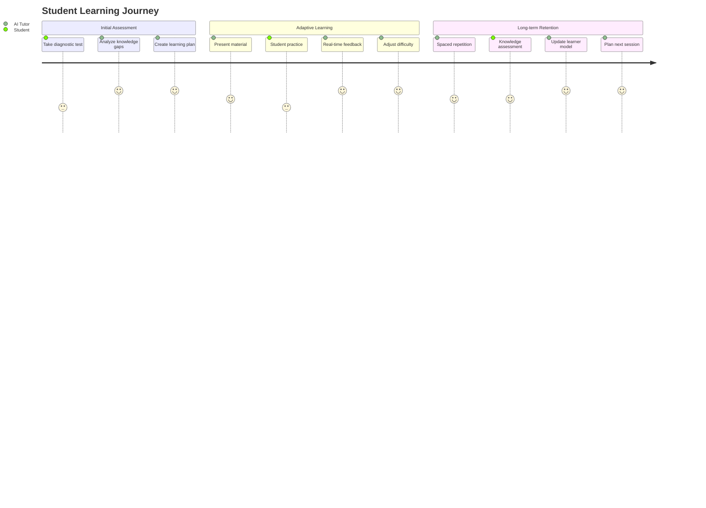

### Customer Service Agents

Knowledge graph for customer relationship management:

```cypher
// Customer journey mapping
MATCH (c:Customer)-[r:INTERACTION]->(agent:Agent)
WHERE r.timestamp > date.sub(date(), duration('P30D'))
RETURN c.id, 
       collect(r.type) as interaction_types,
       avg(r.satisfaction) as avg_satisfaction,
       count(r) as interaction_count
ORDER BY avg_satisfaction DESC
```

### Collaborative AI Teams

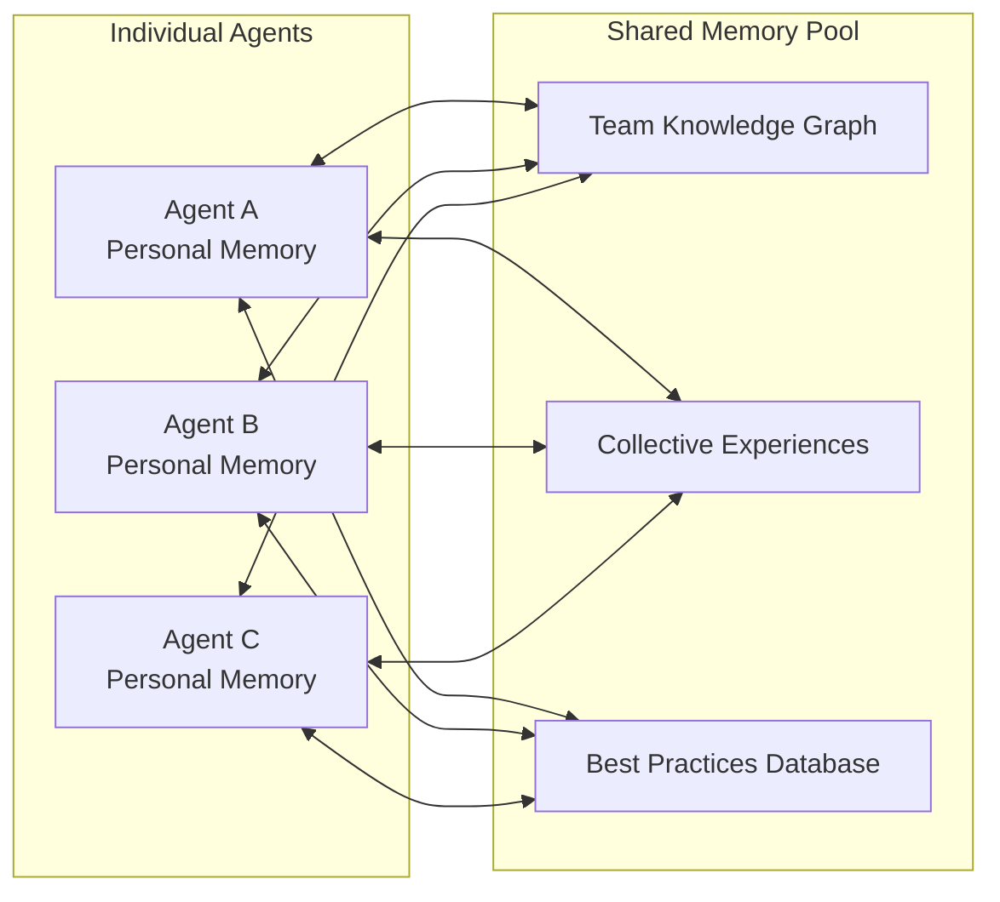

## Future Research Directions

### Emerging Paradigms

#### 1. Neuromorphic Memory Systems
- Brain-inspired architectures
- Spiking neural networks for memory
- Hardware-software co-design
- Energy-efficient learning

#### 2. Quantum-Enhanced Memory
- Quantum superposition for parallel memory access
- Quantum entanglement for relationship modeling
- Quantum algorithms for pattern recognition
- Hybrid classical-quantum systems

#### 3. Federated Learning Memory
- Distributed memory across devices
- Privacy-preserving learning
- Collaborative filtering
- Edge computing integration

### Research Questions

1. **How can we achieve true lifelong learning without catastrophic forgetting?**
2. **What are the optimal memory consolidation strategies for different domains?**
3. **How can we ensure privacy while maintaining personalized memory systems?**
4. **What are the computational limits of real-time memory adaptation?**
5. **How can we create interpretable and explainable memory decisions?**

## Conclusion

Building effective AI memory systems requires a multifaceted approach combining:

- **Hierarchical memory architectures** that mirror human cognition
- **Graph databases** for relationship modeling and knowledge representation
- **Adaptive learning mechanisms** that evolve with user interactions
- **Intelligent forgetting** to maintain relevance and performance
- **Robust retrieval systems** for contextually appropriate information access

The key to success lies in creating systems that balance:
- **Personalization vs. Generalization**
- **Memory retention vs. Computational efficiency**
- **Learning speed vs. Stability**
- **Privacy vs. Functionality**

As we continue to advance these technologies, the goal is to create AI agents that can form meaningful, long-term relationships with users through sophisticated memory and learning capabilities.

---

*This research document serves as a foundation for implementing advanced memory systems in the Reactory AI framework. For implementation details and code examples, refer to the accompanying modules and services.*