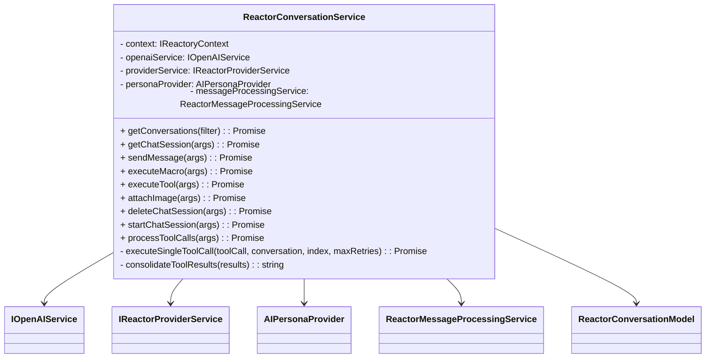
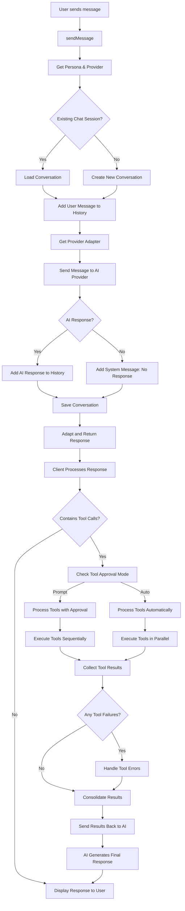

# ReactorConversationService

The `ReactorConversationService` is responsible for managing chat conversations between users and AI personas in the Reactory platform. It handles the creation, retrieval, updating, and deletion of chat sessions, as well as sending messages, executing macros/tools, and attaching images.

## Key Responsibilities

- Manage chat sessions and conversation history
- Interface with AI providers (OpenAI, xAI, etc.)
- Support macros and tools for enhanced interactions
- Attach images and process them with AI models
- Provide error handling and response adaptation
- **NEW**: Orchestrate multiple tool invocations with proper error handling

## Class Diagram



## Enhanced Conversation Control Flow



## Multiple Tool Invocation Improvements

### **Server-Side Enhancements**

#### **1. New `processToolCalls` Method**
```typescript
async processToolCalls(args: {
  toolCalls: any[];
  personaId: string;
  chatSessionId: string;
  executionMode?: 'sequential' | 'parallel';
  maxRetries?: number;
}): Promise<any>
```

**Features:**
- **Parallel Execution**: Execute independent tools simultaneously for better performance
- **Sequential Execution**: Execute tools in order for dependency management
- **Retry Logic**: Automatic retry with exponential backoff for failed tools
- **Error Isolation**: Individual tool failures don't stop the entire sequence
- **Result Consolidation**: Combine multiple tool results into a single response

#### **2. Enhanced Error Handling**
- **Individual Tool Error Tracking**: Each tool's success/failure is tracked separately
- **Graceful Degradation**: Continue processing other tools even if some fail
- **Detailed Error Reporting**: Provide specific error messages for each failed tool
- **Retry Mechanisms**: Automatic retry with configurable attempts and backoff

#### **3. Tool Result Management**
- **Intermediate State Updates**: Update conversation history after each tool execution
- **Result Aggregation**: Combine multiple tool results into a coherent response
- **Context Preservation**: Maintain conversation context throughout tool execution

### **Client-Side Enhancements**

#### **1. Improved Tool Processing Logic**
```typescript
const processToolCalls = async (toolCalls: any[], message: UXChatMessage) => {
  // Group tools by approval requirements
  const toolsRequiringApproval = toolApprovalMode === ToolApprovalMode.PROMPT ? toolCalls : [];
  const toolsForAutoExecution = toolApprovalMode === ToolApprovalMode.AUTO ? toolCalls : [];
  
  // Process tools appropriately
  await processToolsWithApproval(toolsRequiringApproval, toolResults, toolErrors);
  await processToolsAutomatically(toolsForAutoExecution, toolResults, toolErrors);
}
```

#### **2. Parallel Tool Execution**
- **Performance Optimization**: Execute independent tools simultaneously
- **Promise.allSettled**: Handle both successful and failed tool executions
- **Error Isolation**: Individual tool failures don't affect others

#### **3. Enhanced State Management**
- **Tool Result Tracking**: Properly track and display tool execution results
- **Error Reporting**: Show specific error messages for failed tools
- **State Updates**: Update chat state with tool results and errors

## Tool Invocation Modes

### **1. Sequential Mode**
- **Use Case**: Tools with dependencies or side effects
- **Execution**: Tools run one after another
- **Benefits**: Predictable execution order, dependency management
- **Drawbacks**: Slower execution for independent tools

### **2. Parallel Mode**
- **Use Case**: Independent tools that can run simultaneously
- **Execution**: Tools run concurrently
- **Benefits**: Faster execution, better performance
- **Drawbacks**: Potential resource conflicts, harder debugging

## Error Handling Strategies

### **1. Individual Tool Error Handling**
```typescript
try {
  const result = await executeMacro(macro, args);
  toolResults.push(result);
} catch (error) {
  toolErrors.push({
    id: toolCall.id,
    name: toolCall.function.name,
    error: error.message,
    timestamp: new Date()
  });
  // Continue with next tool
}
```

### **2. Retry Logic**
```typescript
for (let attempt = 1; attempt <= maxRetries; attempt++) {
  try {
    return await executeTool(toolCall);
  } catch (error) {
    if (attempt < maxRetries) {
      await new Promise(resolve => setTimeout(resolve, Math.pow(2, attempt) * 1000));
    }
  }
}
```

### **3. Graceful Degradation**
- Continue processing other tools even if some fail
- Provide detailed error reporting for failed tools
- Allow partial success scenarios

## Future Improvements

### **1. Integration with ReactorMessageProcessingService**
The service will eventually be refactored to use the more generic `ReactorMessageProcessingService` for:
- **Advanced Routing**: Route requests to appropriate providers based on capabilities
- **Template Processing**: Apply message templates and parameters
- **Processing Options**: Token limiting, sensitive info filtering, prompt optimization

### **2. Enhanced Tool Orchestration**
- **Dependency Management**: Define tool dependencies and execution order
- **Resource Management**: Control concurrent tool execution limits
- **Timeout Handling**: Configurable timeouts for tool execution
- **Circuit Breaker**: Prevent cascading failures

### **3. Advanced Error Recovery**
- **Fallback Strategies**: Alternative tools or approaches when primary tools fail
- **Partial Result Handling**: Use partial results when possible
- **User Notification**: Better user feedback for tool execution status

## Example Usage

### **Basic Tool Execution**
```typescript
const service = new ReactorConversationService(props, context);
const response = await service.sendMessage({
  personaId: "persona123",
  chatSessionId: "session456",
  message: "Hello, AI!"
});
```

### **Multiple Tool Processing**
```typescript
const toolResults = await service.processToolCalls({
  toolCalls: [
    { function: { name: "search_database", arguments: { query: "users" } } },
    { function: { name: "send_email", arguments: { to: "user@example.com" } } }
  ],
  personaId: "persona123",
  chatSessionId: "session456",
  executionMode: "parallel",
  maxRetries: 3
});
```

## See Also

- [ReactorConversationModel](../models/ReactorChatState.ts)
- [AIPersonaProvider](./AIPersonaProvider.ts)
- [ReactorMessageProcessingService](./ReactorMessageProcessingService.ts)
- [IOpenAIService](../../types/service.types.ts)
