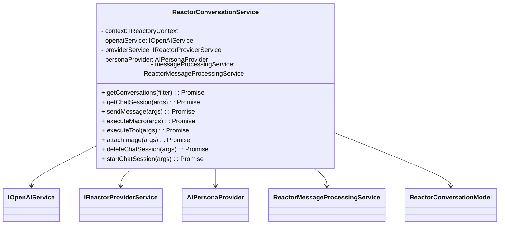
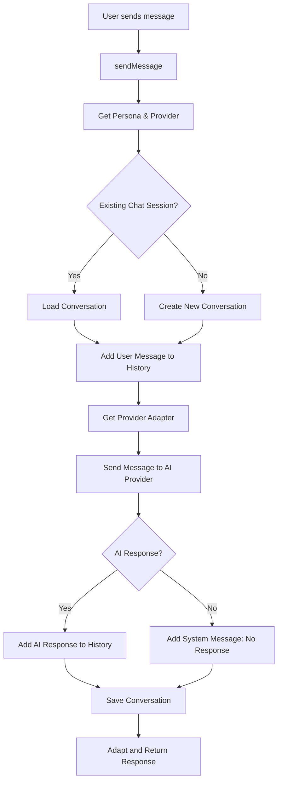

# ReactorConversationService

The `ReactorConversationService` is responsible for managing chat conversations between users and AI personas in the Reactory platform. It handles the creation, retrieval, updating, and deletion of chat sessions, as well as sending messages, executing macros/tools, and attaching images.

## Key Responsibilities

- Manage chat sessions and conversation history
- Interface with AI providers (OpenAI, xAI, etc.)
- Support macros and tools for enhanced interactions
- Attach images and process them with AI models
- Provide error handling and response adaptation

## Class Diagram



## Conversation Control Flow



## Example Usage

```typescript
const service = new ReactorConversationService(props, context);
const response = await service.sendMessage({
  personaId: "persona123",
  chatSessionId: "session456",
  message: "Hello, AI!"
});
```

## See Also

- [ReactorConversationModel](../models/ReactorChatState.ts)
- [AIPersonaProvider](./AIPersonaProvider.ts)
- [IOpenAIService](../../types/service.types.ts)
