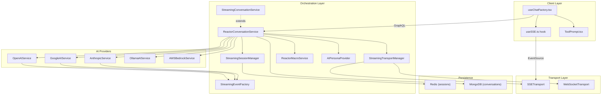
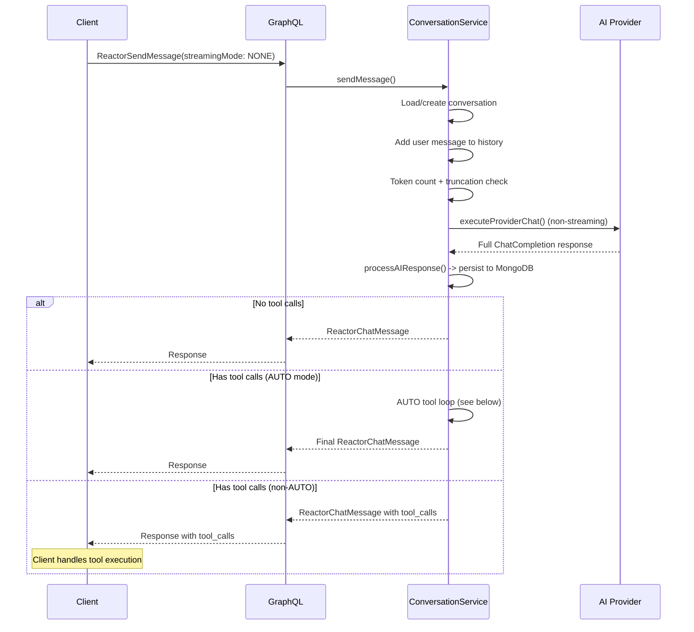
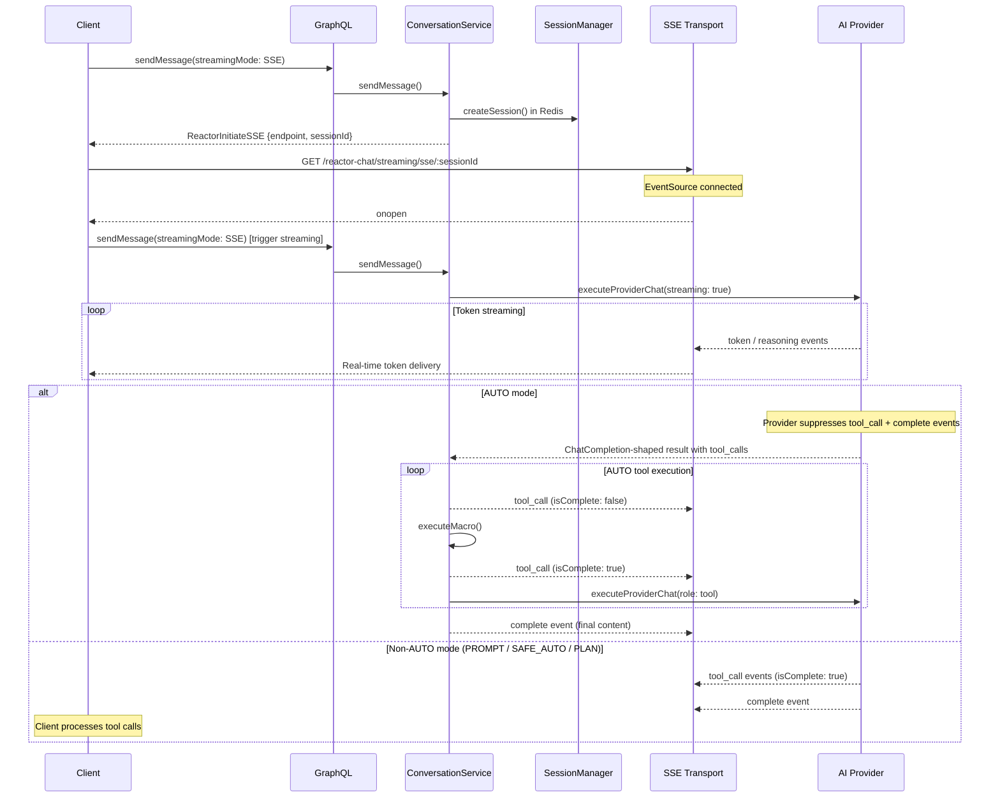
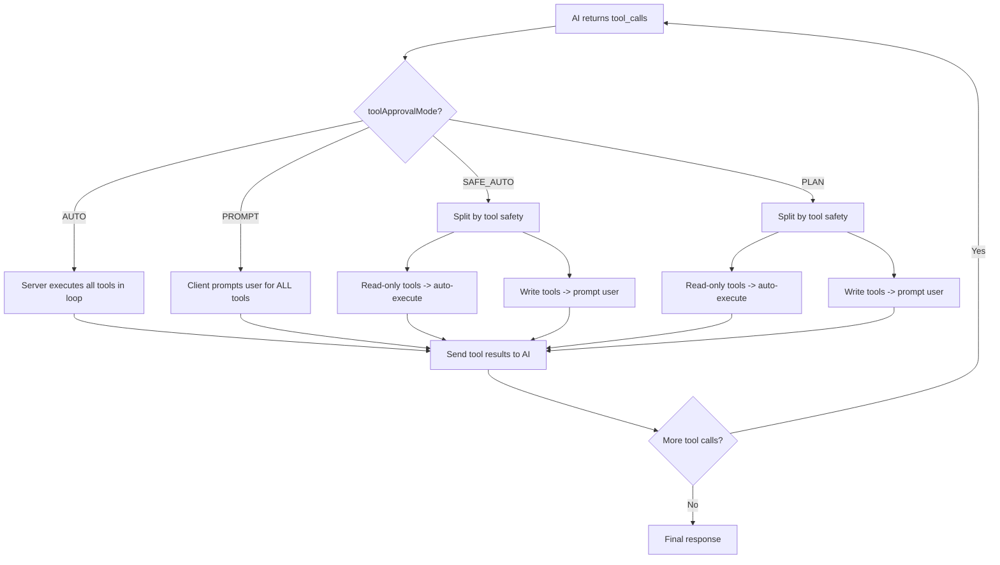

# ReactorConversationService

The `ReactorConversationService` is the core orchestrator for AI-powered conversations in the Reactory platform. It manages the full conversation lifecycle -- session creation, message processing, tool execution, and real-time streaming -- across multiple AI providers.

## Architecture



### Key Services

| Service | ID | Role |
|---|---|---|
| `ReactorConversationService` | `reactor.ReactorConversationService@1.0.0` | Main orchestrator: session CRUD, message routing, tool execution loop |
| `StreamingConversationService` | `reactor.StreamingConversationService@1.0.0` | Extends base service with `sendMessageWithStreaming` (stub, not used in production SSE path) |
| `StreamingSessionManager` | `reactor.StreamingSessionManager@1.0.0` | Redis-backed session lifecycle with 1-hour TTL, in-memory `conversationId -> sessionId` map |
| `StreamingTransportManager` | `reactor.StreamingTransportManager@1.0.0` | Routes `StreamingEvent` to the correct `SSETransport`/`WebSocketTransport` via `chatSessionId -> sseSessionId` mapping |
| `StreamingEventFactory` | (static) | Single factory for all streaming event shapes: token, reasoning, tool_call, complete, error, tool_iteration_limit, retry |
| `ReactorMacroService` | `reactor.ReactorMacroService@1.0.0` | Macro registry and execution engine |
| `AIPersonaProvider` | `reactor.AIPersonaProvider@1.0.0` | Resolves persona configuration (model, provider, tools, system prompt) |

### AI Providers

All providers extend `AIProviderBase`; streaming-capable providers extend `AIStreamingProviderBase`.

| Provider | Streaming | Notes |
|---|---|---|
| `OpenAIService` | Yes | OpenAI + xAI (compatible API). Handles `reasoning_content` for o-series models. |
| `GoogleAIService` | Yes | Google Gemini. Handles thinking mode for applicable models. |
| `AnthropicService` | Yes | Claude. Extended thinking support. |
| `OllamaAIService` | Yes | Local models via Ollama. |
| `AWSBedrockService` | Yes | AWS Bedrock models. |

## Streaming Event Types

Defined in `types/streaming.types.ts`. All events share a `StreamingEventBase` shape (`type`, `sessionId`, `conversationId`, `messageId`, `timestamp`, `data`).

| Type | When Emitted | Data Shape |
|---|---|---|
| `token` | Each text chunk from the AI | `{ content, delta, position, isComplete }` |
| `reasoning` | Chain-of-thought content (o1/o3, Gemini thinking, Claude extended) | `{ content, delta, position, isComplete }` |
| `tool_call` | Tool call detected (non-AUTO) or tool progress (AUTO) | `{ id, name, arguments, isComplete, result? }` |
| `complete` | AI response finished | `{ content, finishReason, thinking? }` |
| `error` | Provider or stream error | `{ code, message, details? }` |
| `tool_iteration_limit` | AUTO loop exceeded `maxToolIterations` | `{ iterationsCompleted, maxIterations, partialContent }` |
| `retry` | Provider retrying after transient error | `{ attempt, maxAttempts, retryAfterMs, reason }` |

## Conversation Flows

### Non-Streaming (GraphQL)



### SSE Streaming



### SSE Connection Lifecycle

1. Client sends initial `sendMessage` with `streamingMode: SSE`
2. Server creates a Redis session via `StreamingSessionManager` and returns `ReactorInitiateSSE` with `endpoint` and `sessionId`
3. Client opens `EventSource` at the endpoint
4. `StreamingEndpoints.handleSSEConnection` creates an `SSETransport` and registers it with `StreamingTransportManager`
5. On `onopen`, client sends a second `sendMessage` to trigger actual AI processing
6. Provider streams events through `StreamingTransportManager.sendEventToSession(conversationId, event)`
7. On completion or error, client closes the `EventSource` (or it auto-reconnects on network failure)

### SSE Reconnection on Session Load

When the client loads an existing conversation (e.g. from the chat list), any previous `EventSource` is gone. The client proactively re-establishes SSE:

1. `loadChat()` fetches the conversation via GraphQL and updates `chatState`
2. If `protocol === 'sse'` and `!sse.connected`, the client sends a lightweight `sendMessage(message: '', streamingMode: 'SSE', continueAfterTools: true)` to the server
3. Server's `sendMessage` detects the missing transport (no active SSE session or transport for this conversation) and returns `ReactorInitiateSSE` without persisting any message
4. Client connects a new `EventSource` at the returned endpoint
5. SSE transport is now active; subsequent `sendMessage` calls will stream correctly

The same pattern applies when the component remounts with an `existingSession` prop (page reload). A fallback path also exists in `sendMessage` itself: if no SSE session is active when a real message is sent, the server returns `ReactorInitiateSSE`, the client connects, and resends the message via the `onConnectionOpened` callback.

Express routes (registered by `StreamingEndpoints.setupRoutes`):

| Route | Method | Purpose |
|---|---|---|
| `/reactor-chat/streaming/sse/:sessionId` | GET | Establish SSE connection |
| `/reactor-chat/streaming/events/:sessionId` | POST | Send events to session |
| `/reactor-chat/streaming/session/:sessionId/status` | GET | Session status |
| `/reactor-chat/streaming/session/:sessionId` | DELETE | Close session |
| `/reactor-chat/streaming/health` | GET | Health check |
| `/reactor-chat/streaming/debug` | GET | Debug info |

## Tool Approval Modes

Stored on the conversation document as `toolApprovalMode`. Determines how tool calls are handled.



| Mode | Enum Value | Server Behavior | Client Behavior |
|---|---|---|---|
| **AUTO** | `auto` | Runs `executeMacro` in a loop (up to `maxToolIterations`). Sends `tool_call` start/complete SSE events. Sends final `complete` event. | Display tool progress. Do NOT re-execute tools. |
| **PROMPT** | `prompt` | Provider sends `tool_call` + `complete` events via SSE. Server does NOT execute tools. | Prompt user for every tool call via `ToolPrompt`. Execute on approval. Send results back via GraphQL. |
| **SAFE_AUTO** | `safe_auto` | Same as PROMPT from server perspective. | Auto-execute read-only tools (from `safeForAutoExecution` metadata). Prompt for the rest. |
| **PLAN** | `plan` | Same as PROMPT from server perspective. | Same split as SAFE_AUTO. Read-only tools auto-execute; others require approval. |

### AUTO Mode Server-Side Tool Loop

Located in `ReactorConversationService.sendMessage()`:

1. After `processAIResponse()` detects `tool_calls` and `toolApprovalMode === AUTO`:
2. Enter `while` loop (max `maxToolIterations`, default `REACTOR_MAX_TOOL_ITERATIONS=100`):
   - For each `tool_call`: emit SSE `tool_call` (isComplete: false) -> `executeMacro()` -> emit SSE `tool_call` (isComplete: true)
   - Send tool results to AI: `executeProviderChat(role: 'tool')`
   - `processAIResponse()` on the follow-up
   - If AI returns more tool_calls, continue loop
3. On loop exit: emit SSE `complete` event with final content
4. If iteration limit reached: emit `tool_iteration_limit` event

### Tool Definition Structure

Tools are defined as `MacroToolDefinition` in `ai/openai/types/chat.ts`:

```typescript
type MacroToolDefinition = {
  type: "function",
  propsMap?: Record<string, string>,
  runat?: "server" | "client",
  enabled?: boolean,
  roles?: string[],
  modes?: ToolApprovalMode[],
  safeForAutoExecution?: boolean,
  function: {
    icon?: string;
    name: string;
    description?: string;
    parameters: Schema;
    componentFqn?: string;
  }
};
```

`modes` controls which approval modes the tool is available in. `safeForAutoExecution` indicates the tool is read-only / side-effect free and can be auto-executed in `safe_auto` and `plan` modes without user approval.

## Client Architecture (ReactorChat)

### Key Hooks and Components

| File | Role |
|---|---|
| `hooks/useChatFactory.tsx` | Main hook: session management, message sending, tool processing pipeline, mode routing |
| `hooks/useSSE.ts` | `EventSource` wrapper with reconnect logic, token drip-feed, event dispatch |
| `hooks/useGraph.ts` | GraphQL operations (sendMessage, executeTool, setChatToolApprovalMode) |
| `hooks/ToolPrompt.tsx` | Approval UI for tool calls in PROMPT/SAFE_AUTO/PLAN modes |
| `hooks/useScrollToBottom.tsx` | Message rendering including tool call cards with status chips |
| `components/ChatInput.tsx` | Mode selection UI (Auto, Safe Auto, Prompt, Plan) |
| `components/ToolsPanel.tsx` | Tools list and settings panel |
| `components/ToolIterationLimitBanner.tsx` | UI for when AUTO loop reaches iteration limit |

### Client SSE Event Handling

`useSSE` registers `addEventListener` for each event type (`token`, `reasoning`, `complete`, `error`, `tool_call`, `start`, `tool_iteration_limit`). All events are dispatched through `handleMessage` which parses JSON and routes to callback refs.

`useChatFactory` wires the callbacks:

| SSE Event | Handler | Action |
|---|---|---|
| `token` | `onTokenReceived` | Append delta to last assistant message |
| `reasoning` | `onReasoningReceived` | Append to `thinking` field (batched at 50ms) |
| `tool_call` | `onToolCallReceived` | Merge into assistant message `tool_calls` array; accumulate in `pendingToolCallsRef` |
| `complete` | `onSSEMessageReceived` | Replace message content with final text; process accumulated tool calls via `processToolCallsMemoized` |
| `tool_iteration_limit` | `onToolIterationLimitReceived` | Show limit banner; update partial content |
| `retry` | `onRetryReceived` | Update placeholder with retry status |
| `error` | `onError` | Network error indicator or chat error message |

### Client Tool Processing Pipeline

After the `complete` event, `processToolCallsMemoized` routes tool calls by mode:

1. **AUTO**: `processToolsAutomatically` -- should be skipped in SSE mode (server already executed)
2. **PROMPT**: `processToolsWithApproval` -- sequential prompting via `ToolPrompt`
3. **SAFE_AUTO / PLAN**: Split tools by `safeForAutoExecution` metadata -> auto-execute safe tools, prompt for the rest

After tool execution, `sendToolResultsToAI` sends results via GraphQL (`streamingMode: NONE`) and handles any follow-up tool calls recursively (up to 10 levels deep).

## Token Management

- **Atomic counting**: MongoDB aggregation pipelines calculate total tokens
- **Truncation**: When tokens exceed max by 20%, older messages move to `truncatedHistory` (preserving system messages)
- **Configurable**: `setChatMaxTokens(chatSessionId, maxTokens)` per conversation

## Data Model

The `ReactorConversationModel` (MongoDB) holds:

| Field | Type | Purpose |
|---|---|---|
| `_id` | ObjectId | Conversation ID |
| `user` | ObjectId | Owning user |
| `personaId` | string | Active persona |
| `history` | Array | Active conversation history |
| `truncatedHistory` | Array | Truncated older messages |
| `tokenCount` | number | Current token count |
| `maxTokens` | number | Token limit |
| `toolApprovalMode` | ToolApprovalMode | Current mode (auto/prompt/safe_auto/plan) |
| `maxToolIterations` | number | AUTO loop limit |
| `started` | Date | Creation time |
| `updated` | Date | Last update |

## GraphQL API

The `ReactorChatResponse` union type: `ReactorChatMessage | ReactorInitiateSSE | ReactorErrorResponse`.

Key mutations:

| Mutation | Purpose |
|---|---|
| `ReactorSendMessage` | Send message (with optional `streamingMode`, `role`, `continueAfterTools`) |
| `ReactorExecuteTool` | Execute a single tool/macro |
| `ReactorSetChatToolApprovalMode` | Change tool approval mode |
| `ReactorSetChatMaxToolIterations` | Set AUTO loop limit |
| `ReactorContinueToolExecution` | Resume after tool iteration limit |

## File Organization

```
services/reactor/
  ReactorConversationService.ts     # Main service (~4500 lines)
  StreamingConversationService.ts   # Extends base (stub)
  StreamingSessionManager.ts        # Redis session lifecycle
  StreamingTransportManager.ts      # Event routing to transports
  StreamingTransport.ts             # SSETransport / WebSocketTransport
  StreamingEndpoints.ts             # Express routes for SSE
  StreamingDebug.ts                 # Debug utilities
  ReactorProviderService.ts         # Provider resolution
  ReactorMessageProcessingService.ts # Generic message routing
  ReactorCapabilityService.ts       # Capability detection
  DocumentChunkingService.ts        # Token estimation
  AIPersonaProvider.ts              # Persona configuration
  types/
    streaming.types.ts              # All streaming type definitions
  streaming/
    StreamingEventFactory.ts        # Consistent event creation
    TokenPacer.ts                   # Token delivery pacing
  providers/
    AIProviderBase.ts               # Base provider class
    AIStreamingProviderBase.ts      # Streaming provider base
    AIProviderError.ts              # Provider error class
    OpenAIService.ts                # OpenAI / xAI
    GoogleAIService.ts              # Google Gemini
    AnthropicService.ts             # Anthropic Claude
    OllamaAIService.ts              # Ollama local models
    AWSBedrockService.ts            # AWS Bedrock
    ReactorMacroService.ts          # Macro registry + execution
```

## See Also

- [ReactorConversationModel](../models/ReactorChatState.ts)
- [AIPersonaProvider](./AIPersonaProvider.ts)
- [ReactorMessageProcessingService](./ReactorMessageProcessingService.ts)
- [Streaming Types](./types/streaming.types.ts)
- [StreamingEventFactory](./streaming/StreamingEventFactory.ts)
- [OpenAIService](./providers/OpenAIService.ts)
- [GraphQL Schema: ReactorChat](../../graphql/schema/ReactorChat.graphql)
- [GraphQL Schema: ReactorPersona](../../graphql/schema/ReactorPersona.graphql)
