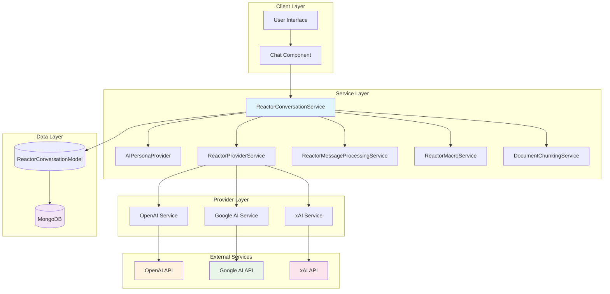
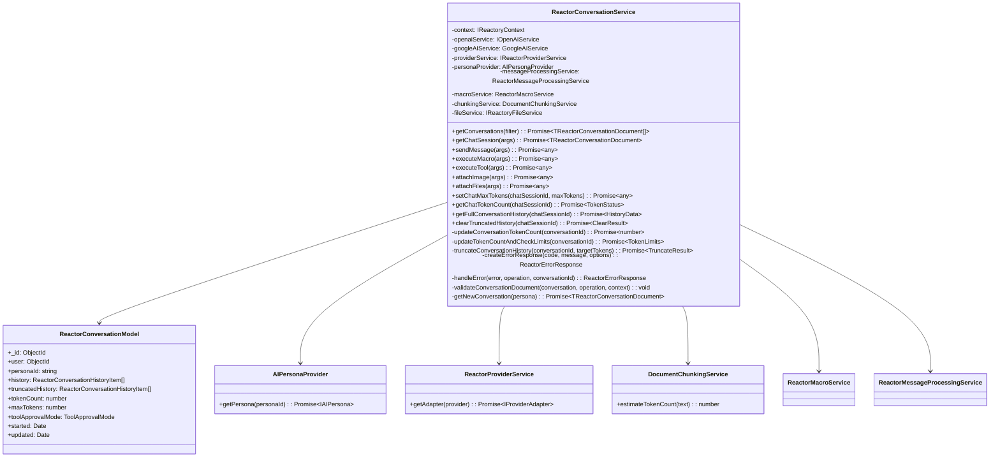
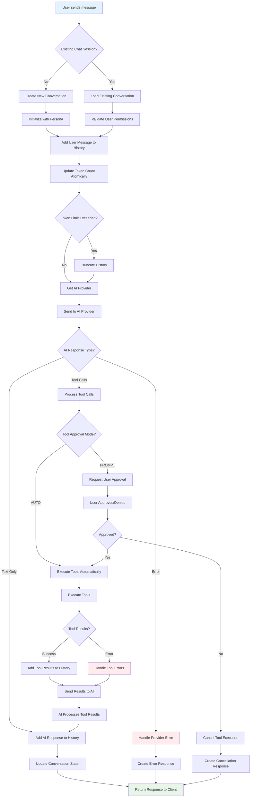
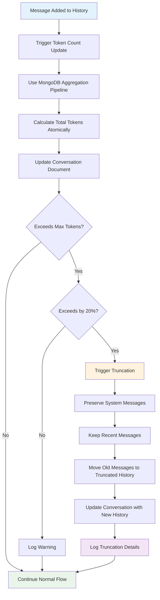
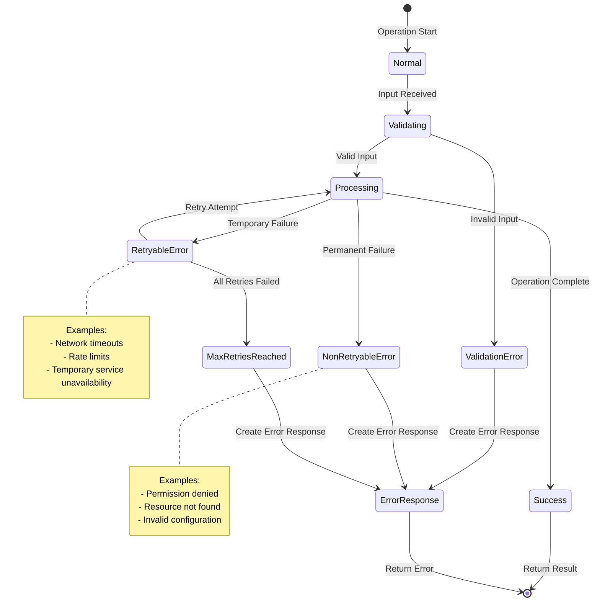

# ReactorConversationService

The `ReactorConversationService` is the core service responsible for managing AI-powered chat conversations in the Reactory platform. It orchestrates interactions between users and AI personas, handling the complete conversation lifecycle from creation to message processing, with advanced features like token management, error recovery, and tool execution.

## Overview

This service acts as the central orchestrator for AI conversations, providing:
- **Conversation Management**: Create, retrieve, update, and manage chat sessions
- **Multi-Provider Support**: Interface with multiple AI providers (OpenAI, xAI, Google AI)
- **Token Management**: Atomic token counting, limits enforcement, and conversation truncation
- **Tool Execution**: Support for macros and tools with parallel/sequential execution modes
- **File Handling**: Attach images and files for AI processing
- **Error Recovery**: Comprehensive error handling with correlation tracking and retry mechanisms
- **Race Condition Prevention**: Atomic database operations to prevent data corruption

## Key Responsibilities

### Core Conversation Management
- **Session Lifecycle**: Create, load, update, and manage conversation states
- **History Management**: Maintain conversation history with truncation support for token limits
- **User Context**: Secure user-scoped conversation access and permissions

### AI Provider Integration
- **Multi-Provider Support**: OpenAI, xAI, Google AI with unified interface
- **Provider Adapters**: Normalize responses across different AI providers
- **Model Management**: Support different models per persona configuration

### Advanced Features
- **Token Management**: Real-time token counting, limit enforcement, and intelligent truncation
- **Tool Orchestration**: Execute macros and tools with dependency management
- **File Processing**: Attach and process images, documents with AI models
- **Error Recovery**: Structured error responses with correlation tracking
- **Race Condition Prevention**: Atomic database operations using MongoDB aggregation pipelines

## Architecture Overview



## Class Relationships



## Message Flow and State Management

### Complete Conversation Flow


### Token Management Flow


### Error Handling State Machine


## Implementation Status

### ✅ Completed Features

#### Race Condition Prevention (Priority 1)
- **Atomic Token Counting**: MongoDB aggregation pipelines for atomic token calculations
- **Consolidated Database Operations**: Single findOneAndUpdate operations instead of find+update
- **Atomic Message History Updates**: Prevents duplicate messages and lost updates
- **Race-Free Conversation Creation**: Single create operation with pre-set IDs

#### Error Handling & Reliability (Priority 2) 
- **Structured Error Responses**: ReactorErrorResponse interface with correlation tracking
- **Error Classification**: Comprehensive error categorization (validation, permission, resource, etc.)
- **Correlation IDs**: UUID-based error tracking for debugging across service boundaries
- **Retry Logic**: Configurable retry mechanisms for transient failures
- **Graceful Degradation**: Continue processing when possible, fail gracefully when not

#### Documentation & Code Quality (Priority 3)
- **Comprehensive JSDoc**: Detailed documentation for all public methods with examples
- **Business Logic Constants**: Named constants for magic numbers and thresholds
- **Inline Comments**: Detailed comments explaining complex business logic
- **Mermaid Diagrams**: Architecture, flow, and state diagrams for visual understanding
- **Usage Examples**: Practical examples for common use cases

### 🔄 In Progress

#### Type Safety Improvements (Priority 4)
- **TypeScript Warnings**: Some @ts-ignore comments and type mismatches remain
- **Interface Completeness**: Some method parameters need proper interface definitions
- **Generic Type Safety**: More specific typing for provider responses

### 📋 Pending Items (Priority 5)

#### Performance Optimizations
- **Database Query Optimization**: Review and optimize aggregation pipelines
- **Connection Pooling**: Implement connection pooling strategies
- **Bulk Operations**: Reduce database roundtrips where possible
- **Caching Strategy**: Implement caching for frequently accessed data

#### Advanced Features
- **Tool Dependency Management**: Define and manage tool execution dependencies
- **Enhanced Metrics**: More detailed performance and usage metrics
- **Circuit Breaker Pattern**: Prevent cascading failures in tool execution

## Example Usage

### **Basic Tool Execution**
```typescript
const service = new ReactorConversationService(props, context);
const response = await service.sendMessage({
  personaId: "persona123",
  chatSessionId: "session456",
  message: "Hello, AI!"
});
```

### **Multiple Tool Processing**
```typescript
const toolResults = await service.processToolCalls({
  toolCalls: [
    { function: { name: "search_database", arguments: { query: "users" } } },
    { function: { name: "send_email", arguments: { to: "user@example.com" } } }
  ],
  personaId: "persona123",
  chatSessionId: "session456",
  executionMode: "parallel",
  maxRetries: 3
});
```

## See Also

- [ReactorConversationModel](../models/ReactorChatState.ts)
- [AIPersonaProvider](./AIPersonaProvider.ts)
- [ReactorMessageProcessingService](./ReactorMessageProcessingService.ts)
- [IOpenAIService](../../types/service.types.ts)
- [Streaming Implementation Plan](./ReactorConversationService-StreamingPlan.md) - **Comprehensive plan for adding real-time streaming support**

## Future Roadmap

### 🚀 Streaming Support (In Planning)
A comprehensive plan has been developed to add real-time streaming capabilities while maintaining full backward compatibility with the existing GraphQL API. See the [Streaming Implementation Plan](./ReactorConversationService-StreamingPlan.md) for detailed architecture and implementation strategy.

**Key Features:**
- **Hybrid Architecture**: Support both stateless GraphQL and stateful streaming
- **Progressive Enhancement**: Opt-in streaming with automatic fallback
- **Real-time Experience**: Token-by-token streaming from AI providers
- **Multiple Transports**: SSE and WebSocket support
- **Session Management**: Redis-backed session persistence
- **Performance Optimized**: Adaptive buffering and intelligent batching
