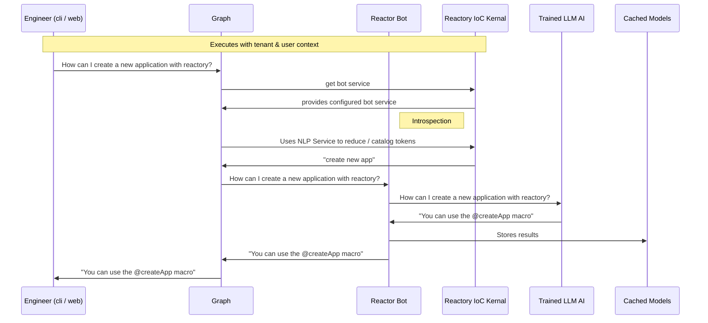
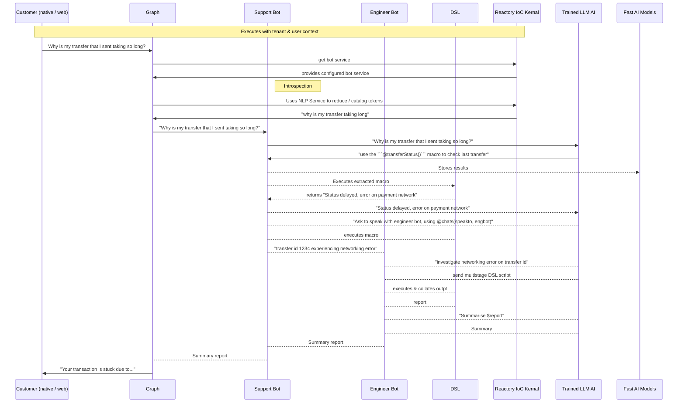

#Overview
The reactor module is an AI focussed module that integrates AI tools and frameworks in order to extend the Reactory eco system. The module allows for a multitenant, multi bot configuration that has deep context of the system it supports as well as the user execution context.

## Engineer Flow

## Customer Flow

